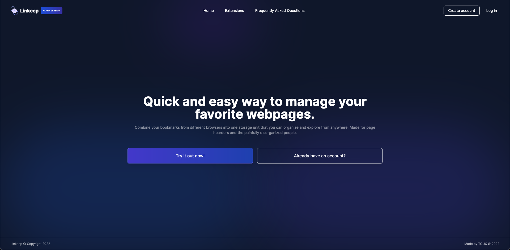
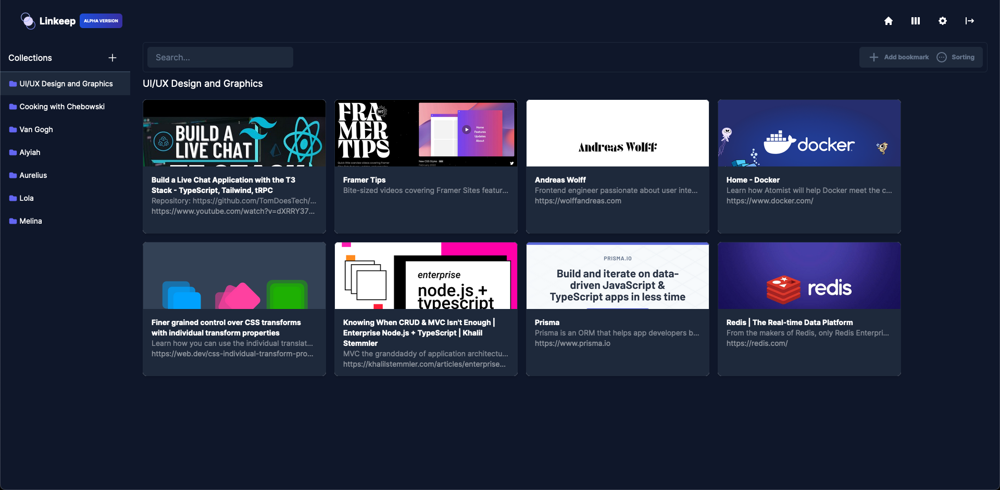

# Linkeep ALPHA
### About (what is it?)
Repo for Linkeep, a webapp, browser extension made to manage and store your bookmarks efficiently.  
Offers full CRUD capabilities and import/exports for bookmarks via the Chrome extension.  
Even though this project is not finished (read below), I thought it'll be a good showcase for my portfolio (code style, different approaches I did etc.).  

### Project is currently on hold
**Main reasons why(personal reasons that made me stop working on this, for now):**
- Initially, this project started as a practice to write a working REST API with Node and a basic authentication flow with JWT and password hashing, therefore I never actually expected to write a frontend or anything more to it.  
- Code is really messy and all over the place, needs a  lot of refactoring (both backend and frontend).  
- TailwindCSS uses a mobile first approach, so I just rushed to style it quickly (for desktop, therefore not responsive) and even separated the JSX code from the Tailwind classes.  
- No actual error handling/error tracking.  
- No input data validation (there is a bit of Zod on some endpoints, but minimal).  
- No test coverage.  

#### Information (tech stack)
- Linkeep tech-stack: 
    - React (with TypeScript)
    - TailwindCSS
    - PostgreSQL (ORM: Prisma)
    - Node (Express server, Zod for input validation, JWT for a basic authentication and authorization flow)
    - Redis (used as an in-memory store/caching)
- The server is a dockerized instance running Alpine as the base image (lightweight, small image size, linux base functionalities).
- PostgreSQL database is running on AWS RDS.
- Backend is deployed on Heroku (Docker Container Registry, as a pre-built image).
- Frontend is deployed on Vercel.

#### Test account
- Email: test@linkeep.com
- Password: password

### How to run it on your machine: 
> To be updated.

